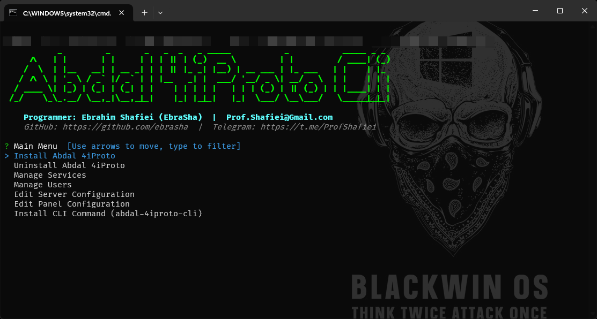

# 🚀 Abdal 4iProto Cli

🌐 Languages: **English** | [فارسی](README.fa.md)

<p align="right">
  
</p>

---

## 💡 Why this software was created

Deploying the full **Abdal 4iProto** stack (Server + Web Panel + SSH KeyGen) by hand is repetitive and error-prone: you have to clone three GitHub repositories, pick the right binary for your OS/architecture, verify checksums, generate SSH keys, craft JSON configurations, choose free ports, and finally register a system service.

**Abdal 4iProto Cli** turns that whole workflow into **one professional, neon-themed command-line tool** that works equally well as an interactive wizard or a fully scripted one-liner – on both Windows and Linux. 🎯

---

## ✨ Features

- 🎨 **Professional UI** – Neon-green ASCII banner, colored boxes, animated progress bars.
- 🧙 **Two modes** – Run with no arguments for an interactive menu, or pass flags for unattended automation.
- 🛡️ **Pre-flight port checks** – Reserved/in-use ports are detected **before** anything is downloaded.
- 📦 **Auto-detect OS/Arch** – Uses `runtime.GOOS` & `runtime.GOARCH` to pick the right release asset.
- 🔐 **SHA-256 verification** – Every downloaded binary is checked against the GitHub release `digest`.
- 🔑 **SSH key generation** – Calls the official KeyGen tool with `ed25519`, `4096` bits, force overwrite by default.
- ⚙️ **Service installation** – `systemd` on Linux, `sc` on Windows, with auto-start.
- 👥 **User management** – List & view, add, edit, and remove SSH users with role, bandwidth, session, and quota controls.
- 🛠️ **Live config editor** – Update server ports, panel credentials, and other settings on the fly.
- 🔄 **Auto-restart** – Services restart automatically after every config or user change.
- 🧰 **Self-install** – Register itself as the global `abdal-4iproto-cli` command.
- ⏱️ **Safe countdown** – Press `q` during the 5-second start countdown to abort.
- 🆙 **Self-Update** – Automatically detects new GitHub releases, intelligently downloads the matching binary for your OS/architecture, and performs a secure upgrade with automatic rollback on failure.
- 🆘 **Built-in help** – Every flag, command, and troubleshooting hint is one `help` away.

---

## 📖 How to use

### 🪄 Interactive mode

Just run the binary with no arguments:

```bash
abdal-4iproto-cli
```

You'll get a colored menu:

- Install Abdal 4iProto
- Uninstall Abdal 4iProto
- Manage Services
- Add / Remove User
- Edit Server / Panel Configuration
- Install CLI Command
- Diagnostics
- Help

### ⚡ Argument mode (automation-friendly)

```bash
# Full stack install with custom server ports and panel port
abdal-4iproto-cli install \
  --server-ports 64235,64236,64237,64238 \
  --panel-port 52202 \
  --panel-username ebrasha \
  --panel-password "your-strong-password"

# Server only
abdal-4iproto-cli install --server-only --key-type ed25519 --key-bits 4096 --key-force

# Panel only
abdal-4iproto-cli install --panel-only --panel-port 52202

# Reinstall binaries only – re-download executables but keep configuration files and user accounts
abdal-4iproto-cli install --keep-data              # full stack, binaries only
abdal-4iproto-cli install --server-only --keep-data
abdal-4iproto-cli install --panel-only --keep-data

# Add a user
abdal-4iproto-cli user add \
  --username ali --password "secret" --role user \
  --max-sessions 2 --max-speed-kbps 512 --max-total-mb 1024

# Remove a user
abdal-4iproto-cli user remove --username ali

# Service operations (status | start | stop | restart | enable | disable)
abdal-4iproto-cli service status     --component server
abdal-4iproto-cli service start      --component server
abdal-4iproto-cli service stop       --component panel
abdal-4iproto-cli service restart    --component panel
abdal-4iproto-cli service enable     --component server
abdal-4iproto-cli service disable    --component panel
abdal-4iproto-cli service diagnostics

# Update configuration
abdal-4iproto-cli config server --ports 64235,64236,64237,64238
abdal-4iproto-cli config panel  --port 52202 --username ebrasha --password "new-pass"

# Self-install as global command
abdal-4iproto-cli self-install

# Self-update – fetch the latest release from GitHub, verify SHA-256, and replace the running binary
abdal-4iproto-cli self-update

# Uninstall – server service only (installation folder is preserved)
abdal-4iproto-cli uninstall --server-only

# Uninstall – panel service only (installation folder is preserved)
abdal-4iproto-cli uninstall --panel-only

# Full uninstall including the installation directory (default)
abdal-4iproto-cli uninstall

# Full uninstall but keep all files on disk
abdal-4iproto-cli uninstall --keep-files

# Help & full reference
abdal-4iproto-cli help
```

### 📂 Installation paths

| Platform | Path                                                    |
|----------|---------------------------------------------------------|
| 🐧 Linux   | `/usr/local/abdal-4iproto-server`                        |
| 🪟 Windows | `%LOCALAPPDATA%\abdal-4iproto-server`                    |

### 🔧 Service names

| Platform | Server                  | Panel                  |
|----------|-------------------------|------------------------|
| 🐧 Linux   | `abdal-4iproto-server`  | `abdal-4iproto-panel`  |
| 🪟 Windows | `Abdal4iProtoServer`    | `Abdal4iProtoPanel`    |

> ⚠️ Installing services and writing to system paths requires **Administrator** (Windows) or **root** (Linux) privileges.

---

## 🐛 Reporting Issues

If you encounter any issues or have configuration problems, please reach out via email at Prof.Shafiei@Gmail.com. You can also report issues on GitLab or GitHub.

## ❤️ Donation

If you find this project helpful and would like to support further development, please consider making a donation:
- [Donate Here](https://t.me/AbdalDonationBot)

## 🤵 Programmer

Handcrafted with Passion by **Ebrahim Shafiei (EbraSha)**
- **E-Mail**: Prof.Shafiei@Gmail.com
- **Telegram**: [@ProfShafiei](https://t.me/ProfShafiei)

## 📜 License

This project is licensed under the GPLv2 or later License.
